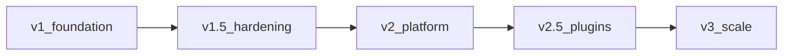

# AssessmentOS roadmap

Living product roadmap. **Shipped** reflects what is in `main` today. Later phases are ordered by dependency and recruiter value, not fixed dates.

---

## Current status — v1 foundation (shipped)

AssessmentOS is usable end-to-end for take-home / timed technical assessments:

| Area | Shipped |
|---|---|
| **Question types** | MCQ, coding (I/O + unit), SQL (SQLite), short answer; stubs for video / design / file |
| **Coding depth** | Multi-file workspace, entry file, time/memory limits, proportional scoring, simple Python I/O checker; unit via pytest / Jest / PHPUnit / JUnit / GoogleTest; mock runner default; Judge0 multi-file unit path |
| **Authoring** | TipTap rich prompts (quotes, code, images), question bank, sections, pools + randomize, publish + invite flow |
| **Candidate** | OTP gate, optional Turnstile CAPTCHA, IP rate limits, timers, activity events |
| **Review** | Per-question scores, anti-cheat timeline + chips, best-score collapse by email |
| **Invites** | Single-use default; multi-use open links with max uses; email templates + Resend |
| **Agents** | Recruiter MCP (assessments, questions, bank, sections, pools, invites, results) |
| **Ops** | Postgres + Drizzle migrations, local disk assets (`STORAGE_DIR`), AGPL-3.0 |

---

## Next — v1.5 hardening & coding ops

Make production deploys and Judge0 unit mode reliable without changing product shape.

1. **Judge0 unit image** — Documented / published Docker image (or compose overlay) with pytest, Node+Jest, PHPUnit, JUnit console jar, GoogleTest so `USE_MOCK_RUNNER=false` works for unit questions out of the box.
2. **Cloud object storage for assets** — S3/R2 adapter behind the same `/assets` URL shape (replace local disk for multi-instance deploys).
3. **Redis (or shared) rate limits** — Move invite IP / OTP limits off a single Postgres node when horizontally scaling the API.
4. **Observability** — Structured request metrics, runner failure dashboards, basic alerting hooks.
5. **Admin polish** — Bank/pool/section UX pass, clearer coding builder defaults, empty-state guidance.

**Exit:** A recruiter can run unit coding assessments against Judge0 in staging with durable image assets and no single-node rate-limit assumptions.

---

## Then — v2 platform (orgs & access)

1. **Organizations / teams** — ✅ Multi-recruiter orgs, roles (owner / author / reviewer), shared banks, org switcher + admin members UI.
2. **SSO** — OIDC/SAML for recruiter login (keep email+password for OSS/self-host). Still later.
3. **API hardening** — ✅ Scoped tokens, audit log of admin actions, webhook on session complete.
4. **Exports** — ✅ PDF/CSV candidate reports; assessment results CSV; bulk invite CSV.

**Landed:** Org-scoped API (`X-Organization-Id`), SDK/MCP org helpers, admin org page (members / webhooks / audit), reviewer write-gating.

**Still later:** SSO and billing (hosted).

**Exit:** A company can onboard multiple recruiters under one org with SSO and auditable API access.

---

## Then — v2.5 question plugins

Graduate stubs and adjacent assessment formats (separate packages, same plugin contract):

1. **File upload** questions (resume / take-home zip review, not auto-graded deeply at first).
2. **Video** response (record or upload + manual score).
3. **Design** / Figma-link or image critique (manual / rubric).
4. **Full interactive checkers** — Codeforces-style interactive protocols (beyond exit-code I/O checkers).

**Exit:** At least one non-coding stub type is first-class in builder, candidate UI, and review.

---

## Later — v3 scale & collab

1. **Live collab / interview mode** — Shared editor + recruiter observer (optional track).
2. **Billing / usage metering** — For hosted SaaS; self-host remains free under AGPL.
3. **Advanced anti-cheat** — Optional proctoring integrations; richer signal models (still privacy-first).
4. **Multi-region / HA** — Runner pools, queue-backed grading, cold-start isolation.

---

## Explicit non-goals (for now)

- Replacing general LMS / ATS products
- Closed-source core (project stays AGPL-3.0)
- Guaranteeing every public Judge0 image runs all unit frameworks without a custom image
- Building a full interactive IDE product (Monaco + multi-file is enough for take-homes)

---

## How we prioritize

1. Recruiter can ship a real take-home this week  
2. Agents (MCP) stay in parity with admin capabilities  
3. Self-host path stays simple (`docker compose` + env)  
4. Plugin contract over one-off question hacks  

When picking the next implementation slice, prefer the top unchecked item under **v1.5**, then **v2**.

---

## Changelog vs this file

Feature commits land in git history; this file is updated when a phase’s **Exit** criteria are met or priorities change. Link from [README.md](./README.md). Wiki copy: [docs/Roadmap.md](./docs/Roadmap.md) (keep in sync when changing priorities).
