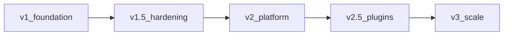

# Roadmap

Living product roadmap. **Shipped** reflects what is in `main` today. Later phases are ordered by dependency and recruiter value, not fixed dates.

---

## Current status — v1 foundation (shipped)

AssessmentOS is usable end-to-end for take-home / timed technical assessments:

| Area | Shipped |
|---|---|
| **Question types** | MCQ, coding (I/O + unit), SQL (SQLite), short answer, video response (record/upload + manual review); stubs for design / file |
| **Coding depth** | Multi-file workspace, entry file, time/memory limits, proportional scoring, simple Python I/O checker; unit via pytest / Jest / PHPUnit / JUnit / GoogleTest; mock runner default; Judge0 multi-file unit path |
| **Authoring** | TipTap rich prompts (quotes, code, images), question bank, sections, pools + randomize, publish + invite flow |
| **Candidate** | OTP gate, optional Turnstile CAPTCHA, IP rate limits, timers, activity events |
| **Review** | Per-question scores, anti-cheat timeline + chips, best-score collapse by email |
| **Invites** | Single-use default; multi-use open links with max uses; email templates + Resend |
| **Agents** | Recruiter MCP (assessments, questions, bank, sections, pools, invites, results, candidates) |
| **Ops** | Postgres + Drizzle migrations, local disk assets (`STORAGE_DIR`), AGPL-3.0 |

---

## Next — v1.5 hardening & coding ops

1. **Judge0 unit image** — ✅ compose overlay + Dockerfile with pytest/Jest/PHPUnit/JUnit/gtest
2. **Cloud object storage for assets** — S3/R2 behind `/assets`
3. **Redis (or shared) rate limits** — for horizontal API scale
4. **Observability** — metrics, runner dashboards
5. **Admin polish** — ✅ bank/pool/section UX + coding defaults + preview run

**Exit:** Unit coding against Judge0 in staging with durable assets.

---

## Then — v2 platform (orgs & access)

1. Organizations / teams — ✅ multi-recruiter orgs, roles, shared banks
2. SSO — OIDC/SAML (keep password for self-host) — still later
3. API hardening — ✅ scoped tokens, audit log, session-complete webhooks
4. Exports — ✅ PDF/CSV packs; bulk invite CSV
5. Candidate directory — ✅ org list, shortlist, cross-assessment history
5b. Integrity / AI-era anti-cheat — ✅ clickwrap + watermarks, richer signals, risk score, optional webcam snapshots (`docs/Integrity.md`)

**Landed:** Org-scoped API + SDK/MCP, admin org UI, reviewer write-gating, candidate directory. SSO/billing still later.

**Exit:** Company onboards multiple recruiters under one org with SSO and auditable API access.

---

## Then — v2.5 question plugins

File upload and design plugins; full interactive checkers. **Video response** (webcam record / upload + manual review) is shipped — see [[Question-Types]].

---

## Later — v3 scale & collab

Live collab, billing (hosted), advanced anti-cheat, multi-region HA.

---

## Explicit non-goals (for now)

- Replacing general LMS / ATS products
- Closed-source core (stays AGPL-3.0)
- Guaranteeing every public Judge0 image runs all unit frameworks without the AssessmentOS unit overlay
- Building a full interactive IDE product

## How we prioritize

1. Recruiter can ship a take-home this week  
2. MCP stays in parity with admin  
3. Self-host stays simple  
4. Plugin contract over one-off hacks  

Canonical copy also lives at repo root `ROADMAP.md`; update both when phase exit criteria change.
